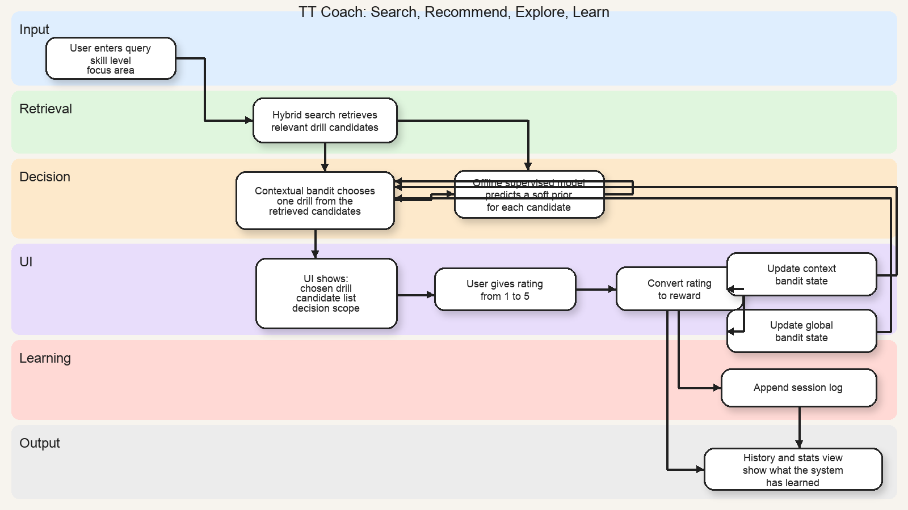

# tt-coach-app

This repository is the **integration shell** for a local-first table tennis coaching system.

Its purpose is not just to show drills. The app is meant to help a player **explore relevant training options, learn from feedback, and gradually surface the strategies that work best for them**.

In practical terms, this app:

- accepts a user query and context
- retrieves relevant drills using semantic search
- uses an offline supervised model as a soft prior when available
- chooses one recommendation using a contextual bandit
- collects explicit feedback
- keeps learning over time
- shows recent history so the learning process is visible

This repo is the place where the pieces come together:

- **frontend UI**
- **backend API**
- **search capability**
- **recommendation / bandit capability**
- local state and session history

---

## 1. What this app does

At a high level, the app helps a player answer:

> *Given what I want to work on, what should I train next — and what seems to work best for me over time?*

The current system does this in four steps:

1. The user enters a query and context
2. Search retrieves relevant drills
3. An offline supervised model can provide a soft prior over those candidates
4. A contextual bandit selects one drill and updates future choices from feedback

Over time, this creates a recommendation loop that can:

- keep exploring alternatives
- keep exploiting what has worked well
- personalise within context
- expose the player’s likely strengths through repeated feedback patterns

This is not yet a complete “player strategy diagnosis” system.  
It is a **search + recommend + explore + learn** system that can move in that direction.

---

## 2. Purpose of the app

The product goal is to help a player **find their edge**.

That does not mean the system assumes it already knows the player’s best strategy.  
Instead, it tries to discover that gradually:

- search keeps recommendations relevant
- the bandit keeps trying promising options
- exploration prevents the system from getting stuck too early
- feedback tells the system what is actually useful

The app is therefore designed around this idea:

> **Explore enough to discover what works.  
> Exploit enough to reinforce what helps.**

That is the core reason a contextual bandit is used here.

---

## 3. How this repo fits with the other repos

This repo is intentionally **not** a monolith.

It composes work from other repositories in the same workspace:

- `tt-semantic-search`
  - provides drill retrieval
  - returns relevant candidate drills for a query

- `table-tennis-multi-armed-bandit`
  - provides the recommendation policy
  - tracks pulls and rewards
  - supports contextual learning

- `tt-supervised-learning`
  - provides an offline supervised prior
  - predicts likely usefulness for drill candidates before enough live data exists
  - currently uses a reduced schema aligned with this app

- `tt-bandit-notifications`
  - related future capability
  - not part of the active demo flow right now

This repo adds:

- a browser frontend
- a lightweight API server
- orchestration across search + bandit
- local session history and reporting

So the mental model is:

```text
tt-coach-app = UI + API + orchestration
tt-semantic-search = retrieval capability
table-tennis-multi-armed-bandit = learning policy capability
tt-supervised-learning = offline prediction prior
tt-bandit-notifications = future delivery capability
```

---

## 4. High-level system flow



---

## 5. Recommendation logic (actual behaviour)

The recommendation loop in this repo works like this:

### A. User input

The app takes:

- `query`
- `skill`
- `goal`

Example:

```json
{
  "query": "backhand topspin",
  "skill": "intermediate",
  "goal": "backhand"
}
```

### B. Search retrieves candidates

The app calls the `tt-semantic-search` capability in **hybrid mode** and gets a ranked list of candidate drills.

This step ensures the recommendation remains tied to user intent.

The retrieval code lives in the separate `tt-semantic-search` repo, but it is part of the live product behaviour here. In other words: the coach app owns the product flow, while the search repo owns the underlying retrieval implementation.

When the coach app asks search for candidates, it gets back structured search results with:

- `id`
- `title`
- `score`
- metadata such as tags and difficulty

Those results become the candidate set for the supervised prior and the contextual bandit.

#### Search modes available in the search repo

The underlying search capability supports:

- `keyword`
  - lexical matching
  - deterministic baseline

- `exact_keyword`
  - strict lexical matching
  - every original query token must appear in the drill text

- `semantic`
  - pure embedding similarity

- `fuzzy_keyword`
  - lexical matching with typo correction
  - useful for misspellings or glued words

- `auto`
  - try `exact_keyword`
  - then `keyword`
  - then `fuzzy_keyword`

- `hybrid`
  - keyword candidate generation first
  - semantic reranking second

The coach app currently uses:

```python
SearchEngine(mode="hybrid")
```

So the user-facing product mode is `hybrid`, but the search repo still exposes the full keyword family because those modes are useful for:

- debugging
- regression testing
- baseline comparisons
- explicit typo-tolerant retrieval

#### How the keyword family works

Before semantic reranking happens, the search repo has a lexical pipeline that can operate in several modes.

The flow is:

1. normalise the raw query
2. tokenize it into words
3. optionally expand tokens using a small synonym map
4. optionally correct misspellings
5. score matching drill documents with a TF-IDF-style lexical score

That means the keyword family is:

- deterministic
- transparent
- model-free

There is no embedding model involved in `exact_keyword`, `keyword`, `fuzzy_keyword`, or `auto`.

#### Exact keyword mode

`exact_keyword` is the strictest lexical mode.

It uses the original query tokens only, not synonym-expanded tokens. A drill is only eligible if **all** of those original query tokens appear in the document terms.

Example:

```text
backhand topspin
```

In strict mode, a document must contain both:

- `backhand`
- `topspin`

If one of those is missing, the document is excluded before scoring.

This is useful as:

- a very interpretable baseline
- a debugging tool
- a safe first pass in `auto` mode

#### Keyword mode

`keyword` is the normal lexical baseline.

It is still lexical search, but it is more forgiving than `exact_keyword` because it uses synonym-expanded tokens from the query-understanding layer.

So a query like:

```text
banana flick short serve
```

can expand toward terms like:

- `flick`
- `banana-flick`
- `short`
- `serve`

That makes the lexical candidate generator more robust before any semantic reranking begins.

#### Fuzzy keyword mode

`fuzzy_keyword` is still lexical search, but it adds typo correction before scoring.

This mode is designed for cases like:

- misspelled tokens
- shorthand that does not exactly exist in the corpus
- glued words such as `backhandflick`

The fuzzy path can:

- try to split a glued token into two valid terms
- spell-correct individual tokens against the drill vocabulary

So fuzzy search fits inside the keyword family as a typo-tolerant lexical fallback. It is not semantic search.

#### Auto mode

`auto` is a keyword-family router.

It tries modes in this order:

1. `exact_keyword`
2. `keyword`
3. `fuzzy_keyword`

So it starts strict, then relaxes only when needed.

That makes `auto` useful when you want a single lexical entrypoint that can degrade gracefully.

#### How keyword scores are calculated

All keyword-family modes use the same underlying TF-IDF-style lexical scoring once a document is eligible.

In simplified form:

```text
score = sum over query terms of tf(term in doc) * idf(term)
score = score / sqrt(document_length + 1)
```

Where:

- `tf(term in doc) = 1 + log(count)` if the term appears
- `idf(term) = log((N + 1) / (df + 1)) + 1`
- the final division lightly normalises for document length

So the keyword score is:

- higher when more query terms appear
- higher when terms appear more often
- higher when those terms are rarer across the drill corpus
- slightly reduced for very long documents

This gives the lexical layer a simple, explainable relevance score without any learned ranking model.

#### Embedding model

The semantic layer uses:

- `sentence-transformers`
- model: `all-MiniLM-L6-v2`

This model embeds:

- each drill document
- the user query

into the same vector space, then compares them with cosine similarity.

In practice, this is what lets the app match meaning rather than exact wording. A user does not need to type the exact drill title for the right candidate to surface.

#### How hybrid search works in the product

In the live coach app, the retrieval path is:

1. User enters a query
2. The keyword baseline generates a candidate set
3. Candidate drills are embedded / compared semantically
4. Candidates are reranked with a hybrid score
5. Top candidates are returned to the coach app

Current hybrid settings in the search repo:

- `candidate_k = 20`
- `alpha = 0.7`

So the final hybrid score is approximately:

```text
final_score = 0.7 * semantic_score + 0.3 * normalised_keyword_score
```

This means the system behaves like:

- keyword search defines what is allowed into the candidate pool
- semantic similarity decides what best matches the meaning of the query

In the current implementation, hybrid candidate generation uses the normal `keyword` mode, not `exact_keyword`, `fuzzy_keyword`, or `auto`.

So the live product path is:

- synonym-aware lexical candidate generation first
- semantic reranking second

The stricter and fuzzier keyword modes are available in the search capability, but they are not the default candidate generator in the coach app right now.

#### Query understanding before scoring

The search repo also does lightweight query understanding before keyword scoring.

That includes:

- normalisation
- tokenization
- synonym expansion
- simple entity extraction

Examples:

- `bh` -> `backhand`
- `banana` -> `flick`
- `loop` <-> `topspin`
- `underspin` <-> `backspin`

This helps the app interpret user intent better before semantic reranking even happens.

The query-understanding layer is intentionally small and inspectable. It is not a large language model rewriting the query. It is a compact rules-and-synonyms pass that makes the retrieval layer more robust without making it opaque.

#### Fallback behaviour

Hybrid search has an explicit fallback:

- if keyword candidate generation returns nothing
- the search layer falls back to **pure semantic search** over the full drill set

So the product is more robust than a pure keyword search system.

That matters because users do not always type neat drill names. They might enter:

- shorthand
- mixed terminology
- misspelled phrases
- intent-based descriptions instead of exact drill labels

The system first tries to stay safe with keyword recall. If that path is too narrow, it still has a semantic-only fallback instead of returning nothing.

#### Current drill catalogue available to search

The current local drill corpus includes these items:

- `drill_001` — Backhand topspin vs block (crosscourt)
- `drill_002` — Forehand topspin vs block (crosscourt)
- `drill_003` — Backhand flick against short serve
- `drill_004` — Short push to short push (touch)
- `drill_005` — Third-ball attack (serve + forehand loop)
- `drill_006` — Third-ball attack (serve + backhand loop)
- `drill_007` — Random placement blocking
- `drill_008` — Serve practice: short backspin variations
- `drill_009` — Serve receive: read spin and choose (push/flick)
- `drill_010` — Footwork: Falkenberg (BH corner, FH corner, middle)

These are the current “products” the search system is matching against when a user types a query.

At the moment, the catalogue spans a few clear training clusters:

- topspin consistency
- serve receive and short-game touch
- third-ball attack
- serve practice
- blocking and placement
- footwork patterns

So when a user searches, the system is not searching the internet or a giant vector database. It is searching this local curated drill set and trying to match the query to the most relevant training intent inside that set.

#### Concrete example

Example input:

```text
banana flick short serve
```

Typical reasoning path:

- keyword layer finds serve-receive / short-ball candidates
- synonym handling maps `banana` toward `flick`
- semantic reranking boosts drills whose meaning matches a short-serve flick situation

A likely strong result is:

- `drill_003` — Backhand flick against short serve

Why this is a good result:

- `banana` is interpreted as a flick-style receive
- `short serve` points toward over-the-table serve-receive drills
- semantic similarity favors drills about the same game situation, not just generic backhand content

So even though the user did not type the exact drill title, the system still surfaces the correct intention.

Another example:

```text
backhand topspin
```

Typical strong candidates are:

- `drill_001` — Backhand topspin vs block (crosscourt)
- `drill_006` — Third-ball attack (serve + backhand loop)
- `drill_003` — Backhand flick against short serve

This shows the search layer doing the right kind of narrowing:

- it keeps clearly relevant backhand attack content
- it can include adjacent drills that are still meaningfully related
- it removes obviously irrelevant options before the bandit makes a decision

This is exactly the retrieval behaviour the coach app needs before personalisation begins.

### C. The bandit chooses one drill

The bandit does **not** choose from the whole world.  
It chooses from the search candidates returned for the current query.

This gives the app two useful properties:

- search keeps results relevant
- bandit learns which relevant options work better in practice

### D. Global vs context decision

The app uses two levels of learning:

- **global bandit**
  - used when there is not enough context-specific evidence yet
- **context bandit**
  - used when the current context has enough history

Context currently means:

- `skill`
- `goal`

So these are different contexts:

- `beginner + backhand`
- `intermediate + backhand`
- `intermediate + serve`

The current switch rule is:

- if the current context has fewer than `10` pulls across the current candidate set, use the **global** bandit
- otherwise, use the **context** bandit

This gives the app a reasonable cold-start behaviour:

- early on, use broader population-level learning
- later, trust the user-specific context more

### E. Offline supervised prior

The app now supports an **offline supervised prior** trained in the `tt-supervised-learning` repo.

That model currently uses a reduced feature schema aligned with the live coach app:

- `drill_id`
- `focus`
- `skill_level`

At recommendation time, the app builds those features for each candidate and predicts a soft usefulness score in `[0, 1]`.

That predicted score becomes the bandit prior.

This is useful because:

- cold-start behaviour is better than bandit-only learning
- the app gets offline guidance before enough live feedback exists
- real feedback can still override the prior over time

If the supervised predictor is unavailable, the app falls back to the older search-score prior.

---

## 6. How reward is calculated

The current feedback signal is explicit user rating:

- `1` to `5`

That rating is converted to reward in `[0, 1]` using:

```text
reward = (rating - 1) / 4
```

So:

- `1` → `0.00`
- `2` → `0.25`
- `3` → `0.50`
- `4` → `0.75`
- `5` → `1.00`

This reward is then written into:

- context bandit state
- global bandit state
- session history log

The choice to keep reward simple is intentional:

- it keeps learning inspectable
- it makes demo behaviour easy to reason about
- it avoids hidden heuristics

---

## 7. Learning state vs history log

This repo separates learning from observability.

The system now has two different learning layers:

- **offline supervised learning**
  - trained outside the request loop
  - used as a soft prior

- **online bandit learning**
  - updated after each recommendation and rating
  - used for live adaptation

### Learning state

Files in `state/` such as:

- `bandit_state__global.json`
- `bandit_state__skill=intermediate__goal=backhand.json`

These files are:

- mutable
- directly used for learning
- overwritten as the bandit updates

### History log

File:

- `state/sessions.jsonl`

This file is:

- append-only
- human-inspectable
- used for history and reporting
- not the source of learning state

This separation matters because it keeps:

- bandit state focused on decision-making
- session history focused on auditability and explanation

---

## 8. Frontend and API structure

The current app uses:

- **frontend**
  - Vite app in `frontend/`

- **backend**
  - lightweight Python HTTP API in `tt_coach_app/web.py`

The frontend talks to the backend through these endpoints:

- `POST /api/recommend`
- `POST /api/feedback`
- `GET /api/history`
- `GET /api/stats`

### API flow

```text
UI -> POST /api/recommend -> API returns chosen drill + candidates
UI -> POST /api/feedback  -> API records reward + returns updated stats
UI -> GET  /api/history   -> API returns recent sessions + summary
```

The UI is therefore just a client.  
The actual decision logic stays in the backend.

---

## 9. Current project structure

```text
tt-coach-app/
├─ frontend/                # Vite frontend
├─ tt_coach_app/
│  ├─ main.py               # recommendation + learning logic
│  ├─ web.py                # API server
│  ├─ analyze_sessions.py   # session reporting helpers
│  ├─ session_log.py        # JSONL append helpers
│  └─ state_paths.py        # state file path helpers
├─ state/                   # local learning state and history
└─ README.md
```

---

## 10. Running the app

### Prerequisites

You need:

- Python environment for this repo
- Node.js for the frontend
- access to the sibling capability repos or installed packages for:
  - `tt_semantic_search`
  - `tt_bandit`

If the search package or bandit package are not importable, install them into the current Python environment or expose them on `PYTHONPATH`.

### Start the backend

From the repo root:

```bash
TT_COACH_PORT=8001 ./.venv/bin/python -m tt_coach_app.web
```

This starts the API on:

```text
http://127.0.0.1:8001
```

### Start the frontend

In a second terminal:

```bash
cd frontend
npm install
npm run dev
```

This starts the UI on:

```text
http://127.0.0.1:3000
```

The Vite proxy forwards `/api/*` requests to the Python backend on port `8001`.


---

## 11. Troubleshooting

### Backend starts but recommendation fails

Most likely cause:

- the semantic search dependency needs a local embedding model that is not available yet

If that happens:

- check backend logs
- confirm `tt-semantic-search` is installed and usable
- confirm the embedding model is available locally if required

### Frontend loads but API calls fail

Check:

- backend is running on port `8001`
- frontend Vite dev server is running on `3000`
- `frontend/vite.config.ts` still points `/api` to `http://127.0.0.1:8001`

### History totals look frozen

This was previously caused by summary logic using only recent rows.  
Current behaviour should:

- show recent events in the list
- compute summary from the full session log

---

## 12. Current limitations

This app is still a prototype.

Current limitations include:

- feedback is explicit rating only
- context is still small (`skill`, `goal`)
- recommendation quality depends on search candidate quality
- there is no deep player model yet
- notifications are not part of the active flow
- “best strategy” is inferred only indirectly through repeated feedback patterns

That said, the current system is already useful for demonstrating:

- retrieval + recommendation composition
- contextual exploration
- local-first learning state
- inspectable recommendation history

---

## 13. Why this repo matters

This repo is where the system starts to feel like a real product.

The search repo retrieves.
The bandit repo learns.
This repo turns them into something a player can actually use:

- query
- recommendation
- feedback
- history

That is the bridge from “ML components” to “coaching app”.
